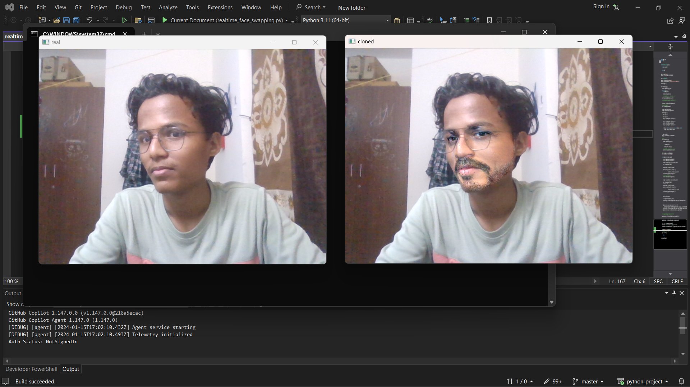
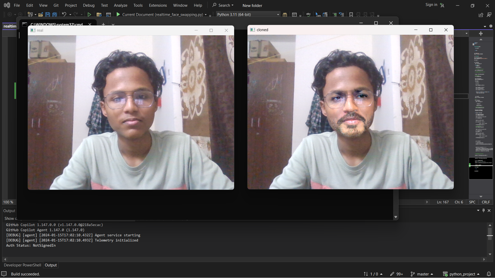
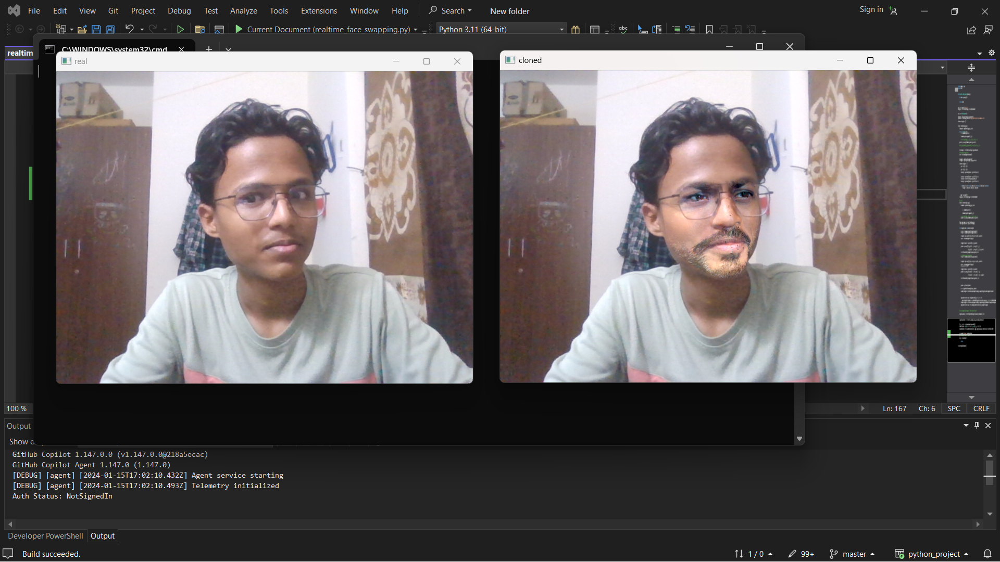

# Real-Time Face Swapping using OpenCV
## Project Overview:
This project focuses on implementing real-time face swapping using OpenCV, a popular computer vision library. The goal is to create a system that can seamlessly replace faces in a video stream, providing a fun and interactive experience. The project is inspired by deepfake technology but aims to achieve face swapping in real-time, making it suitable for live applications.

## Features:
- Real-Time Face Detection: The system utilizes OpenCV's face detection capabilities to identify faces in a video stream.

- Facial Landmark Detection: Once faces are detected, facial landmarks are identified to accurately map the facial features.

- Face Swapping Algorithm: A face swapping algorithm is implemented to replace the detected face with another face seamlessly.

- User Interaction: The application allows users to choose different faces for swapping in real-time, providing an interactive and engaging experience.

- Performance Optimization: Efforts are made to optimize the performance to ensure real-time processing, allowing the application to run smoothly even on modest hardware.

## Requirements:
- Python 3.x
- OpenCV
- NumPy
- Dlib (for facial landmark detection) // does not work in vscode 
## Note- first install cmake and add bin  file path in environment variable , then install dlib 
## Installation:
- Clone the repository:

- bash
- Copy code
- git clone https://github.com/your-username/realtime-face-swapping.git
- Install dependencies:

- bash
- Copy code
- pip install -r requirements.txt
- Download pre-trained models:

- Facial Landmark Detection: Dlib's pre-trained shape predictor model
## Usage:
- Run the main application script:

bash
- Copy code
- python realtime_face_swapping.py
- Interact with the application:

- To exit the application, press 'Q'.

## Troubleshooting:
- If you encounter any issues, refer to the troubleshooting section in the documentation or create a new issue on the project's GitHub repository.

## Contributing:
- Contributions are welcome! If you have any ideas for improvement, bug fixes, or additional features, please open an issue or submit a pull request.
# Screenshots

 

## Acknowledgments:
Special thanks to the OpenCV and Dlib communities for their excellent libraries.
Inspired by deepfake technology, exploring ethical and responsible use of face-swapping techniques.
Feel free to customize this README according to the specifics of your project and include relevant information about the usage, setup, and customization options.
